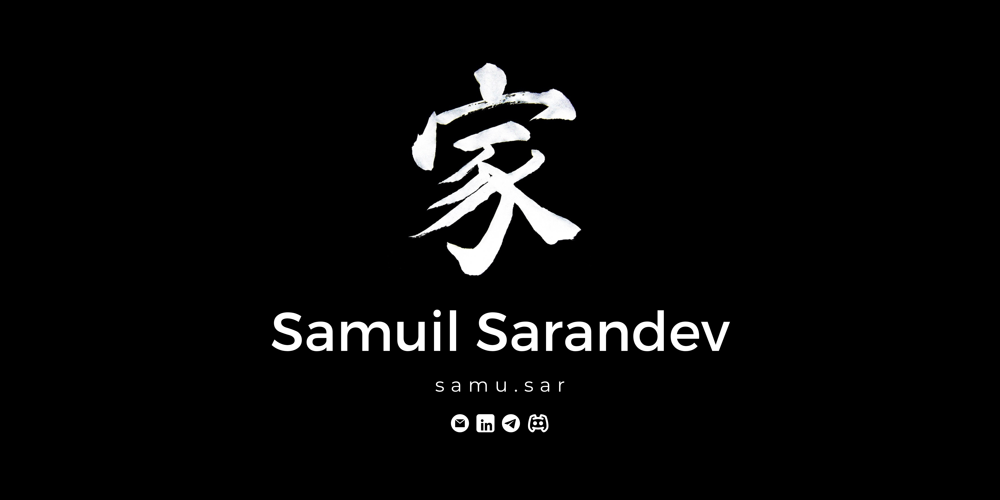

# Samuil Sarandev _(samu.sar)_

## Software Developer

### ✨Go-Getter, Team Player & Ideator✨

 

-   🔭 I’m currently working on personal apps, portfolio projects, and _DXC_ things.
-   🌱 I’m currently learning PHP, Laravel and patience.
-   👯 I’m looking to collaborate on Full-Stack projects, as well as any and all other interesting things permitted by law.
-   💡 My previous professional experience has been in new business development and product management.

 

-   💻 As a dev, I'm adaptive, a quick-learner, creative, flexible, _a bit pedantic_, and a good communicator.
-   👨‍💻 As a pro, I'm dedicated, hard-working, and an innovative-thinker.

 

-   💬 As a "me", I love me some arthouse films, gourmet food, and hide-and-seek in large spaces.

 

📫 How to reach me:

-   ✉️ email: samuil.sarandev@gmail.com
-   👨‍💼 linkedin: [Samuil Sarandev](https://www.linkedin.com/in/samuil-sarandev/)
-   📱 telegram: [@samu_sar](https://t.me/samu_sar)
-   👾 discord: [@samu.sar](https://discord.com/users/940654338857127999)
